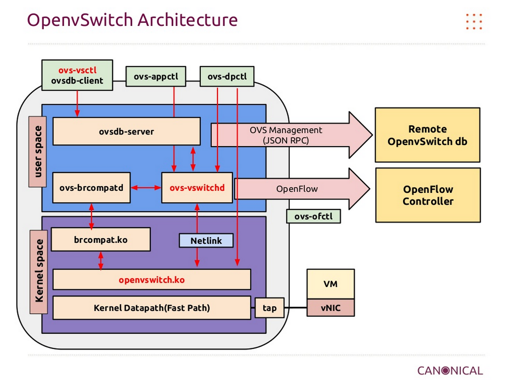
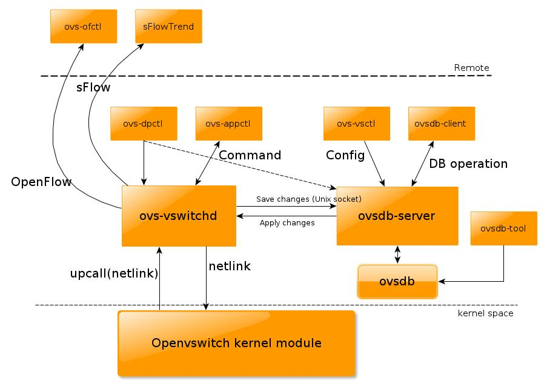

# Tìm hiểu về Open vSwitch 
# Mục lục
## [1. Open vSwitch là gì?](#whatis)
## [2. Kiến trúc của Open vSwitch](#arch)
### [2.1 Kiến trúc tổng quan](#arch-brief)
### [2.2 Kiến trúc chi tiết](#arch-detail) 
## [3. Các thành phần của Open vSwitch](#components)
### [3.1. vswitchd](#daemon) 
### [3.2. ovsdb](#ovsdb) 
### [3.3. datapath](#datapath)
## [4. Xử lý gói tin của Open vSwitch](#pkt-handling)
## [5. Các công cụ chính tương tác với Open vSwitch](#ovs-tools)
## [6. Tham khảo](#ref)

--- 

##  1. Open vSwitch là gì?
- Open vSwitch là phần mềm switch mã nguồn mở hỗ trợ giao thức OpenFlow
- Open vSwitch được sử dụng với các hypervisors để kết nối giữa các máy ảo trên một host vật lý và các máy ảo giữa các host vật lý khác nhau qua mạng.
- Open vSwitch cũng được sử dụng trên một số thiết bị chuyển mạch vật lý (Ví dụ: switch Pica8)
- Open vSwitch là một trong những thành phần quan trọng hỗ trợ SDN (Software Defined Networking - Công nghệ mạng điều khiển bằng phần mềm)
- Tính năng:
	- Hỗ trợ VLAN tagging và chuẩn 802.1q trunking
	- Hỗ trợ STP (spanning tree protocol 802.1D)
	- Hỗ trợ LACP (Link Aggregation Control Protocol)
	- Hỗ trợ port mirroring (SPAN/RSPAN)
	- Hỗ trợ Flow export (sử dụng các giao thức sflow, netflow)
	- Hỗ trợ các giao thức đường hầm (GRE, VXLAN, IPSEC tunneling)
	- Hỗ trợ kiểm soát QoS
	
##  2. Kiến trúc của Open vSwitch
###  2.1 Kiến trúc tổng quan

- Open vSwitch thường được sử dụng để kết nối các VMs/containers trong một host. Ví dụ như trên OpenStack compute node, nó được sử dụng với vai trò là __integration bridge__ để kết nối các VMs chạy trên Compute node đó. Nó quản lý cả các port vật lý (eth0, eth1) và các port ảo (ví dụ như tap port của các VMs).
- Ba khối thành phần chính của Open vSwitch được mô tả như trên hình:
	- __vswitchd__:
		- Là ovs daemon chạy trên user space
		- Công cụ tương tác: ovs-dpctl, ovs-appctl, ovs-ofctl, sFlowTrend
	- __ovsdb-server__:
		- Là database server của Open vSwitch chạy trên user space
		- Công cụ tương tác: ovs-vsctl, ovsdb-client
	- __kernel module__ (datapath):
		- Là module thuộc kernel space, thực hiện công việc chuyển tiếp gói tin

###  2.2 Kiến trúc chi tiết

##  3. Các thành phần của Open vSwitch

###  3.1. vswitchd
- __ovs-vswitchd__ là daemon của Open vSwitch chạy trên userspace. Nó đọc cấu hình của Open vSwitch từ __ovsdb-server__ thông qua kênh IPC (Inter Process Communication) và đẩy cấu hình xuống ovs bridge (là các instance của thư viện __ofproto__). Nó cũng đẩy trạng thái và thông tin thống kê từ các ovs bridges vào trong database.
- __ovs-vswitchd__ giao tiếp với:
	- __outside world__ sử dụng OpenFlow
	- __ovsdb-server sử dụng giao thức OVSDB protocol
	- __kernel__ thông qua __netlink__ (tương tự như Unix socket domain)
	- __system__ thông qua abstract interface là __netdev__
- __ovs-vswitchd__ triển khai mirroring, bonding và VLANs
	

###  3.2. ovsdb
- Nếu như những cấu hình tạm thời ví dụ như flows được lưu trong datapath và vswitchd thì các cấu hình bền vững sẽ được lưu trữ trong __ovsdb__ và vẫn lưu giữ khi sau khi khởi động lại hệ thống. Các cấu hình này bao gồm cấu hình về bridge, port, interface, địa chỉ của OpenFlow controller ()nếu sử dụng),...
- __ovsdb-server__ cung cấp giao diện RPC(remote procedure call) tới __ovsdb__. Nó hỗ trợ trình khách JSON-RPC kết nối tới thông qua passive TCP/IP hoặc Unix domain sockets.
- __ovsdb-server__ chạy hoặc như một backup server hoặc như một active server. Tuy nhiên chỉ có active server mới xử lý giao dịch làm thay đổi __ovsdb__.

###  3.3. datapath
- Module chính chịu trách nhiệm chuyển tiếp gói tin trong Open vswitch, triển khai trong kernelspace nhằm mục đích đạt hiệu năng cao. Nó caches lại OpenFlow flows và thực thi các __action__ trên các gói tin nhận được nếu các gói tin nó match với một flow đã tồn tại. Nếu gói tin không khớp với bất kì flow nào thì gói tin sẽ được chuyển lên __ovs-vswitchd__. Nếu flow matching tại vswitchd thành công thì nó sẽ gửi gói tin lại cho kernel datapath kèm theo các __action__ tương ứng để xử lý gói tin đồng thời thực hiện cache lại flow đó vào datapath để datapath xử lý những gói tin cùng loại đến tiếp sau. Hiệu năng cao đạt được ở đây là vì thực tế hầu hết các gói tin sẽ match flows thành công tại datapath và do đó sẽ được xử lý trực tiếp tại kernelspace.
- Phân loại datapath mà Open vSwitch hỗ trợ:
	- Linux upstream: là datapath triển khai bởi module của nhân đi cùng với bản phát hành Linux.
	- Linux OVS tree: là datapath triển khai bởi module của nhân phát hành cùng với cây mã nguồn của Open vSwitch. Một số tính năng của module này có thể không hỗ trợ với các kernel phiên bản cũ, trong trường hợp này, Linux kernel version tối thiểu sẽ được đưa ra để tránh bị biên dịch lỗi
	- Userpace datapath: datapath cho phép xử lý và chuyển tiếp gói tin ở userspace, điển hình là DPDK.
	- Hyper-V: hay còn gọi là Windows datapath
	
##  4. Xử lý gói tin của Open vSwitch

- Open vSwitch là một phần mềm switch hỗ trợ OpenFlow
- OpenFlow controller chịu trách nhiệm hướng dẫn cho datapath biết làm sao xử lý các loại gói khác nhau, hay còn gọi là __flows__. Một __flow__ mô tả hành động mà datapath thực hiện để xử lý các gói tin của cùng một loại như thế nào, hay còn được gọi là __action__. Các kiểu hành động bao gồm chuyển tiếp tới port khác, thay đổi vlan tag,... Quá trình tìm kiếm flow khớp với gói tin nhận được gọi là __flow matching__.
- Nhằm mục đích đạt hiệu năng tốt, một phần của flows được cache trong datapath, và phần còn lại ở __vswitchd__.
- Một gói tin đi vào Open vSwitch datapath sau khi nó được nhận trên một card mạng. Nếu gói tin khớp với flow nào đó trong datapath thì datapath sẽ thực thi các actions tương ứng mô tả trong flow entry. Nếu không (flow missing), datapath sẽ gửi gói tin lên ovs-vswitchd và tiến trình flow-matching khác được xử lý tại đây. Sau khi __ovs-vswitchd__ xác định làm sao để xử lý gói tin, nó gửi trả gói tin lại cho datapath cùng với yêu cầu xử lý. Đồng thời, __vswitchd__ cũng yêu cầu datapath cache lại flow để xử lý các gói tin tương tự sau đó.

##  5. Các công cụ chính tương tác với Open vSwitch

- __ovs-vsctl__: tiện ích chính sử dụng để quản lý các switch, nó tương tác với __ovsdb-server__ để lưu cấu hình vào database của Open vSwitch. __ovs-vsctl__ thực hiện truy vấn và áp dụng các thay đổi vào database tùy thuộc vào lệnh ta thực hiện. __ovsdb-server__ sẽ nói chuyện với __ovs-vswitchd__ qua giao thức OVSDB. Sau đó, nếu __ovs-vsctl__ áp dụng bất kì thay đổi nào thì mặc định nó sẽ đợi __ovs-vswitchd__ kết thúc việc tái cấu hình lại switch. 
- __ovs-appctl__: cũng là công cụ để quản lý ovs-vswitchd bênh cạnh __ovs-vsctl__, nó gửi một số command nội bộ tới __ovs-vswitchd__ để thay đổi một số cấu hình và in ra phản hồi từ __ovs-vswitchd__. __ovs-vswitchd__ đồng thời cũng lưu lại các cấu hình này vào database bằng việc tương tác với __ovsdb-server__ thông qua Unix domain socket.
- __ovs-dpctl__: đôi khi ta cần quản lý dapapath trong kernel trực tiếp mà thậm chí __ovsdb-server__ không chạy, ta có thể sử dụng __ovs-dpctl__ tương tác với __ovs-vswitchd__ để quản lý datapath trong kernelspace trực tiếp mà không cần database.
- __ovsdb-client__ và __ovsdb-tool__: khi cần nói chuyện với __ovsdb-server__ để thực hiện một số thao tác với database, ta sử dụng __ovsdb-client__, hoặc nếu muốn xử lý database trực tiếp không thông qua __ovsdb-server__ thì sử dụng __ovsdb-tool__.
- __ovs-ofctl__ và __sFlowTrend__: Open vSwitch có thể được quản trị và giám sát bởi một remote controller. Điều này lý giải tại sao ta có thể định nghĩa mạng bằng phần mềm (hay Open vSwitch hỗ trợ SDN). Cụ thể hơn, sFlow là giao thức dể lấy mẫu gói tin và giám sát, trong khi OpenFlow là giao thức để quản lý flow table của switch, bridge hoặc device. Open vSwitch hỗ trợ cả OpenFlow và sFlow. Với __ovs-ofctl__, ta có thể sử dụng OpenFlow để kết nối với switch và thực hiện giám sát và quản trị từ xa. Trong khi đó __sFlowTrend__ không phải là thành phần trong Open vSwitch packet mà là phần mềm độc lập hỗ trợ giám sát sử dụng sFlow.

##  6. Tham khảo
- [1] - [https://www.youtube.com/watch?v=rYW7kQRyUvA](https://www.youtube.com/watch?v=rYW7kQRyUvA)
- [2] - [https://arthurchiao.github.io/blog/ovs-deep-dive-0-overview/](https://arthurchiao.github.io/blog/ovs-deep-dive-0-overview/)
- [3] - [https://arthurchiao.github.io/blog/ovs-deep-dive-0-overview/](https://arthurchiao.github.io/blog/ovs-deep-dive-0-overview/)
- [4] - [http://blog.csdn.net/ifzing/article/details/41308449](http://blog.csdn.net/ifzing/article/details/41308449)
- [5] - [http://openvswitch.org/support/dist-docs/](http://openvswitch.org/support/dist-docs/)