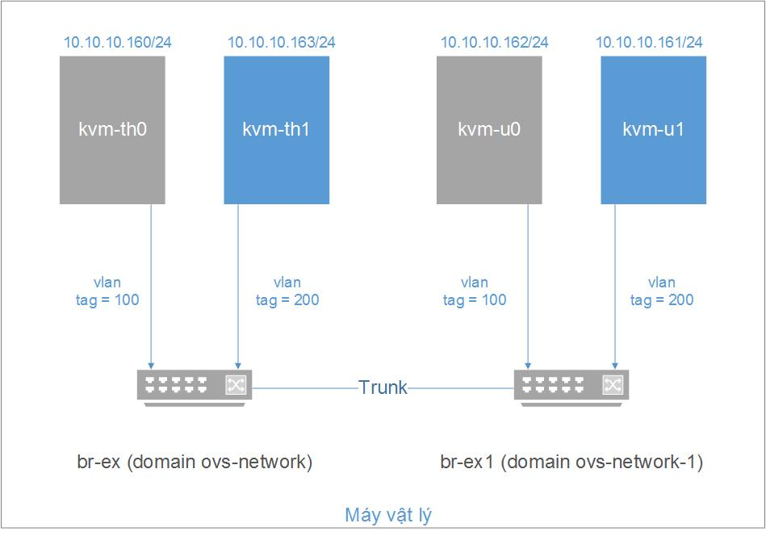
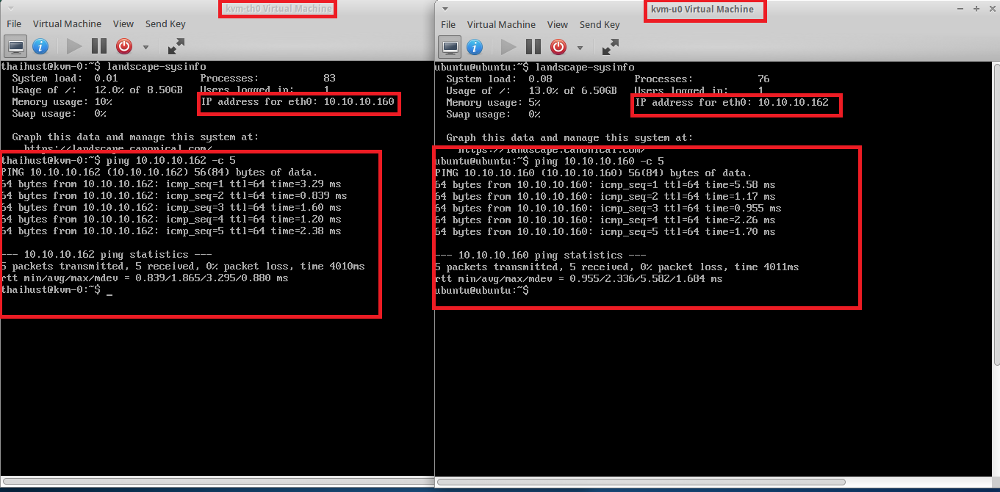
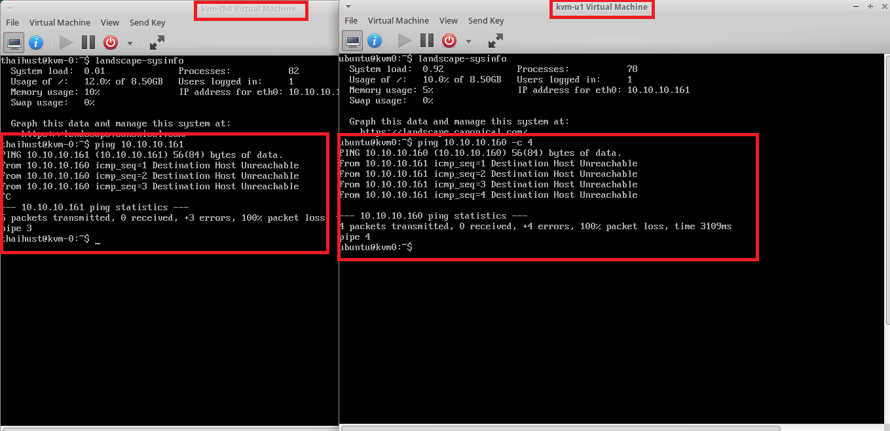

# VLAN với OpenvSwitch
# Mục lục
## [1. Topology](#topo)
## [2. Cài đặt và cấu hình VLAN](#config)
### [2.1. Cài các gói phụ thuộc và phần mềm cần thiết](#required)
### [2.2. Cấu hình VLAN](#cfg)
## [3. Tham khảo](#ref)

---

## <a name="topo"></a> 1. Topology
- Đồ hình: 



- Chuẩn bị:
    - Máy vật lý: cài ubuntu 14.04, kvm, openvswitch. 
    - Sử dụng OpenvSwitch tạo 2 switch ảo br-ex, br-ex1 kết nối với nhau bằng một đường trunk, thiết lập các vlan tag 100 và 200.
    - Tạo 4 máy ảo gán vào các vlan tương ứng với các tab interface của 2 switch ảo trên:
        - __kvm-th0__ và __kvm-th1__: gán vào switch __br-ex__
        - __kvm-u0__ và __kvm-u1__: gàn vào switch __br-ex1__
        - Gán các máy ảo vào các vlan: __kvm-th0__ và __kvm-u0__ gán vào vlan 100, __kvm-th1__ và __kvm-u1__ gán vào vlan 200.
    - Tiến hành ping giữa các máy ảo kiểm tra hoạt động của vlan.

## <a name="config"></a> 2. Cài đặt và cấu hình VLAN
### <a name="required"></a> 2.1. Cài các gói phụ thuộc và phần mềm cần thiết
- Chuẩn bị cài đặt các gói phần mềm phụ thuộc sau:
    - __KVM:__ tham khảo cách cài trên ubuntu 14.04 theo hướng dẫn của [howtoforge](https://www.howtoforge.com/tutorial/kvm-on-ubuntu-14.04)
    - __OpenvSwitch:__ phiên bản cài đặt tối thiểu là 2.0.
### <a name="cfg"></a> 2.2. Cấu hình VLAN
- Tạo các switch ảo và cấu hình vlan tag
    - Tạo switch ảo:

    ```sh 
    ovs-vsctl add-br br-ex
    ovs-vsctl add-br br-ex1 
    ```

    - Tạo các tap interface và gắn vlan tag (các máy ảo được coi như các access port trên các vlan):

    ```sh
    # tab interfaces on br-ex
    ovs-vsctl add-port br-ex tap0 tag=100
    ovs-vsctl add-port br-ex tap1 tag=200
    # tab interfaces on br-ex1
    ovs-vsctl add-port br-ex1 tap2 tag=100
    ovs-vsctl add-port br-ex1 tap3 tag=200 
    ```

    - Tạo các trunk port trên các switch ảo và tạo đường trunk kết nối hai switch:

    ```sh
    # create trunk ports on switches
    ovs-vsctl add-port br-ex trk
    ovs-vsctl add-port br-ex1 trk1
    # combine 2 switches
    ovs-vsctl set interface trk type=patch options:peer=trk1
    ovs-vsctl set interface trk1 type=patch options:peer=trk
    ```

    - Kiểm tra lại cấu hình các switch:

    ```sh
    ovs-vsctl show
    ...
    Bridge "br-ex1"
        Port "br-ex1"
            Interface "br-ex1"
                type: internal
        Port "trk1"
            Interface "trk1"
                type: patch
                options: {peer=trk}
        Port "tap2"
            tag: 100
            Interface "tap2"
        Port "tap3"
            tag: 200
            Interface "tap3"
    Bridge br-ex
        Port br-ex
            Interface br-ex
                type: internal
        Port "tap1"
            tag: 200
            Interface "tap1"
        Port "eth1"
            Interface "eth1"
        Port "tap0"
            tag: 100
            Interface "tap0"
        Port trk
            Interface trk
                type: patch
                options: {peer="trk1"}
    ovs_version: "2.0.2"
    ```

- Tạo network cho các máy ảo kết hợp OpenvSwitch với libvirt: Để khai báo network mới với libvirt, ta tạo một file định dạng _*.xml_ và sử dụng công cụ __virsh__ (thường cài đặt cùng với kvm-qemu) để áp dụng cấu hình trong file đó.
Ở đây, ta khai báo 2 file xml cấu hình 2 network tương ứng với hai switch ảo ở trên:
    - Cấu hình network tương ứng br-ex: `vi ovs-vlan.xml`:

    ```sh
    <network>
      <name>ovs-network</name>
      <forward mode='bridge'/>
      <bridge name='br-ex'/>
      <virtualport type='openvswitch'/>
      <portgroup name='vlan-00' default='yes'>
      </portgroup>
      <portgroup name='vlan-100'>
        <vlan>
          <tag id='100'/>
        </vlan>
      </portgroup>
      <portgroup name='vlan-200'>
        <vlan>
          <tag id='200'/>
        </vlan>
      </portgroup>
      <portgroup name='vlan-all'>
        <vlan trunk='yes'>
          <tag id='100'/>
          <tag id='200'/>
        </vlan>
      </portgroup>
    </network>
    ```

    - Cấu hình network tương ứng với br-ex1: `vi ovs-vlan_br-ex1.xml`

    ```sh
    <network>
      <name>ovs-network-1</name>
      <forward mode='bridge'/>
      <bridge name='br-ex1'/>
      <virtualport type='openvswitch'/>
      <portgroup name='vlan-00' default='yes'>
      </portgroup>
      <portgroup name='vlan-100'>
        <vlan>
          <tag id='100'/>
        </vlan>
      </portgroup>
      <portgroup name='vlan-200'>
        <vlan>
          <tag id='200'/>
        </vlan>
      </portgroup>
      <portgroup name='vlan-all'>
        <vlan trunk='yes'>
          <tag id='100'/>
          <tag id='200'/>
        </vlan>
      </portgroup>
    </network>
    ```

    - Áp dụng cấu hình network mới:

    ```sh
    # define new networks
    virsh net-define ovs-vlan.xml
    virsh net-define ovs-vlan_br-ex1.xml

    # start new networks
    virsh net-start ovs-network
    virsh net-start ovs-network-1
    
    # auto start networks when turning on
    virsh net-autostart ovs-network
    virsh net-autostart ovs-network-1
    ```

- Tạo các máy ảo và thiết lập network cho các máy ảo: 
    - Tạo 4 máy ảo và thực hiện cấu hình network cho 4 máy ảo sử dụng công cụ __virsh__. Ví dụ ở đây ta cấu hình network cho máy ảo kvm-th0 theo topo. Cấu hình các máy ảo thiết lập trong 1 file _*.xml_ nằm trong thư mục `/etc/libvirt/qemu/`. Để chỉnh sửa cấu hình một máy ảo, ta sử dụng lệnh:

    ```sh
    virsh edit kvm-th0
    ```

    - Thiết lập cho máy ảo này thuộc vlan-100 và gán vào switch br-ex (tương ứng với ovs-network). Ta chỉnh sửa section <interface> như sau:

    ```sh
    <interface type='network'>
      <mac address='52:54:00:10:aa:1c'/>
      <source network='ovs-network' portgroup='vlan-100'/>
      <model type='virtio'/>
      <address type='pci' domain='0x0000' bus='0x00' slot='0x03' function='0x0'/>
    </interface>
    ```

    - Tiến hành cấu hình tương tự cho các máy ảo khác theo đúng topology.

- Kiểm tra kết nối các máy tính trên các vlan:
    - Cấu hình ip tĩnh cho các máy ảo như topology.
    - Tiến hành ping giữa các máy trong cùng vlan: kvm-th0 với kvm-u0(vlan-100), kvm-th1 với kvm-u1 (vlan-200). Kết quả ping thành công.
    - Tiến hành ping giữa các máy khác vlan: kvm-th0 với kvm-th1 hoặc kvm-u1 (cũng có thể kiểm tra ping kvm-u0 với kvm-th1 hoặc kvm-u1). Kết quả ping không thành công.
    - Demo:
        - ping giữa hai máy cùng vlan __vlan-100__ là __kvm-th0__ và __kvm-u0__:

        

        - ping giữa hai máy khác vlan __kvm-th0__ và __kvm-u1__:

        


## <a name="ref"></a> 3. Tham khảo
- [1] - [http://openvswitch.org/support/config-cookbooks/vlan-configuration-cookbook/](http://openvswitch.org/support/config-cookbooks/vlan-configuration-cookbook/)

- [2] - [http://blog.scottlowe.org/2012/11/07/using-vlans-with-ovs-and-libvirt/](http://blog.scottlowe.org/2012/11/07/using-vlans-with-ovs-and-libvirt/)

- [3] - [http://blog.scottlowe.org/2013/05/28/vlan-trunking-to-guest-domains-with-open-vswitch/](http://blog.scottlowe.org/2013/05/28/vlan-trunking-to-guest-domains-with-open-vswitch/)
