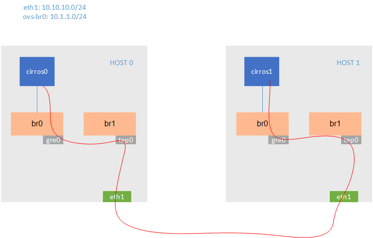
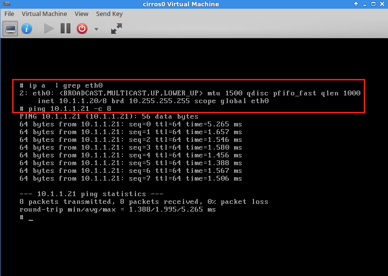
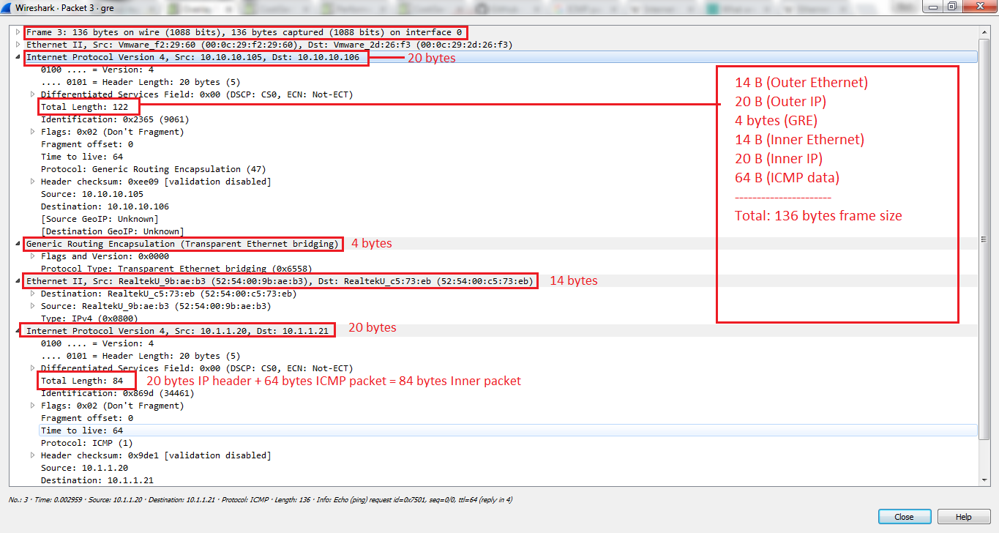
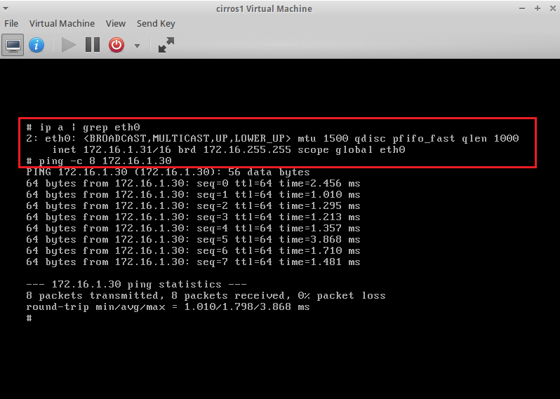
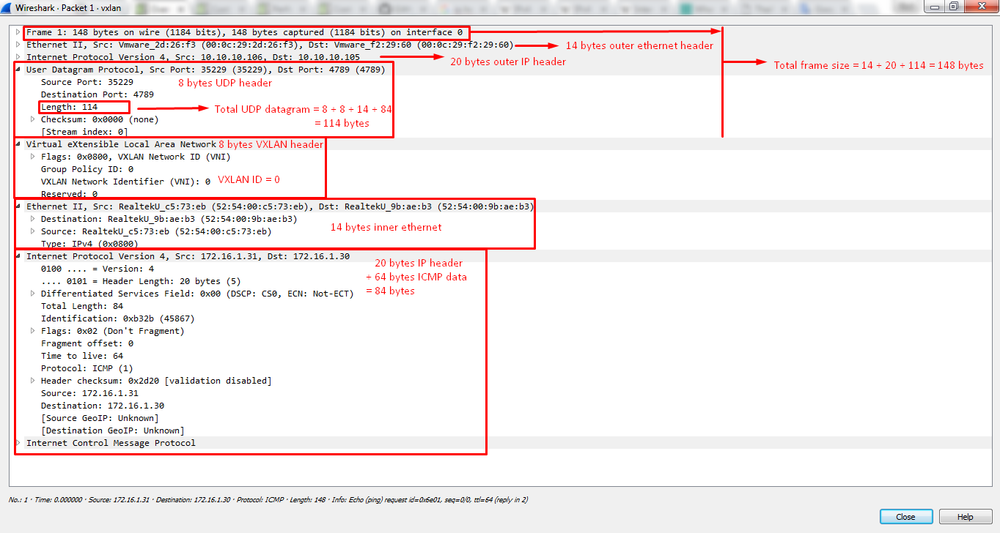

# Lab cấu hình GRE, VXLAN sử dụng OpenvSwitch
# Mục lục
## [1. GRE](#gre)
### [1.1. Topology](#gtopo)
### [1.2. Cấu hình](#gcfg)
### [1.3. Phân tích trên wireshark](#gw)
## [2. VXLAN](#vxlan)
### [2.1. Topology](#vxtopo)
### [2.2. Cấu hình](#vxcfg)
### [2.3. Phân tích trên wireshark](#vxw)
## [3. Tham khảo](#ref) 
---

## <a name="gre"></a> 1. GRE
### <a name="gtopo"></a> 1.1. Topology
- Đồ hình:



- Yêu cầu 2 host: 
    - Chạy ubuntu desktop 14.04
    - Cài sẵn KVM, virt-manager, OpenvSwitch

### <a name="gcfg"></a> 1.2. Cấu hình
- Chú ý:
    - HOST 0: eth1 - 10.10.10.105/24
    - HOST 1: eth1 - 10.10.10.106/24

- Trên host 0: Cấu hình hai bridge __br0__ - kết nối với các VM, và tạo kết nối tunnel sử dụng GRE tunnel interface và __br1__ - tunnel endpoint kết nối với card eth1. Thực chất không cần sử dụng một tunnel endpoint tách biệt như vậy. Tuy nhiên trong thực tế, việc này cho phép tách biệt quản lý lưu lượng của hypervisor và quản lý lưu lượng GRE, cho phép sử dụng mạng quản lý bên ngoài.

```sh
# cau hinh br1 lam tunnel endpoint
sudo ovs-vsctl add-br br1
sudo ovs-vsctl add-port br1 eth1
sudo ifconfig eth1 0
sudo ifconfig br1 10.10.10.105/24

# cau hinh br0 và gre tunnel interface
sudo ovs-vsctl add-br br0
sudo ifconfig br0 10.1.1.1/24
sudo ovs-vsctl add-port br0 gre0 -- set interface gre0 type=gre options:remote_ip=10.10.10.106
```

- Trên host 1 cấu hình tương tự:

```sh
sudo ovs-vsctl add-br br1
sudo ovs-vsctl add-port br1 eth1
sudo ifconfig eth1 0
sudo ifconfig br1 10.10.10.106/24

sudo ovs-vsctl add-br br0
sudo ifconfig br0 10.1.1.2/24
sudo ovs-vsctl add-port br0 gre0 -- set interface gre0 type=gre options:remote_ip=10.10.10.105
```

- Cấu hình chung trên hai host: Tạo một libvirt network tương ứng với bridge __br0__ để kết nối các máy ảo vào. Cấu hình file `vi ovs-gre.xml` định nghĩa ovs-gre network như sau:

```sh
<network>
  <name>ovs-gre</name>
  <forward mode='bridge'/>
  <bridge name='br0'/>
  <virtualport type='openvswitch'/>
</network>
```

Lưu lại file và áp dụng cấu hình tạo libvirt network mới:

```sh
virsh net-define ovs-gre.xml
virsh net-start ovs-gre
virsh net-autostart ovs-gre
```

- Kiểm tra kết nối: Trên HOST 0 tạo máy ảo `cirros0`, trên HOST 1 tạo náy ảo `cirros 1` và cấu hình địa chỉ tĩnh cho các máy này (dải 10.1.1.0/24). Tiến hành ping thử giữa hai máy và sử dụng wireshark trên host lắng nghe các bản tin này trên interface __eth1__. Kết quả ping thành công như sau:


        
### <a name="gw"></a> 1.3. Phân tích trên wireshark
- Phân tích một gói tin ICMP bắt được trên interface eth1:



- Có thể thấy rằng layer 2 frame (chứa thông tin ICMP/IP giữa hai host `10.1.1.20` và `10.1.1.21`) được đóng gói hoàn toàn trong bản tin GRE/IP của các địa chỉ ngoài `10.10.10.105` và `10.10.10.106`.   

## <a name="vxlan"></a> 2. VXLAN
### <a name="vxtopo"></a> 2.1. Topology
- Vẫn sử dụng topology như trên nhưng thay thế bridge __br0__ dành cho kết nối GRE bằng bridge __br-vxl__ cho kết nối VXLAN, thay GRE port __gre0__ bằng VXLAN port __vxl0__ tương ứng. Cấu hình chi tiết như bên dưới.

### <a name="vxcfg"></a> 2.2. Cấu hình
- Cấu hình tương tự như với GRE, tiến hành tạo thêm 1 bridge __br-vxl__ - kết nối với các VM, và tạo kết nối tunnel sử dụng VXLAN tunnel interface.
- Trên HOST 0: Cấu hình bridge __br-vxl__ cho các VM sử dụng dải mạng `172.16.1.0/24`. Tạo thêm 1 VXLAN port - __vxl0__ để tạo đường hầm kết nối theo giao thức VXLAN:

```sh
ovs-vsctl add-br br-vxl
ifconfig br-vxl 172.16.1.20/24
ovs-vsctl add-port br-vxl vxl0 -- set interface vxl0 type=vxlan options:remote_ip=10.10.10.106
```

- Trên HOST 1: Cấu hình tương tự HOST 0:

```sh
ovs-vsctl add-br br-vxl
ifconfig br-vxl 172.16.1.21/24
ovs-vsctl add-port br-vxl vxl0 -- set interface vxl0 type=vxlan options:remote_ip=10.10.10.105
```

- Cấu hình chung trên hai host: Tạo libvirt network tương ứng với bridge __br-vxl__ để các máy ảo kết nối vào: `vi ovs-vxlan.xml`:

```sh
<network>
  <name>ovs-vxl</name>
  <forward mode='bridge'/>
  <bridge name='br-vxl'/>
  <virtualport type='openvswitch'/>
</network>
```

Lưu lại file cấu hình. Áp dụng cấu hình tạo network mới:

```sh
virsh net-define ovs-vxlan.xml
virsh net-start ovs-vxl
virsh net-autostart ovs-vxl
```

- Kiểm tra kết nối: Vẫn sử dụng hai máy ảo cirros như bài lab với GRE, tuy nhiên lựa chọn network là __ovs-vxl__ vừa mới cấu hình. Sau đó đặt địa chỉ tĩnh cho các máy này trong dải __172.16.1.0/24__. Tiến hành ping thử giữa hai máy và sử dụng wireshark trên host lắng nghe các bản tin này trên interface __eth1__. Kết quả ping thành công như sau:



### <a name="vxw"></a> 2.3. Phân tích trên wireshark
- Phân tích một gói tin ICMP bắt được trên interface eth1:



- Ở trong bản tin ICMP đem phân tích ở trên, có thể thấy xuất hiện VXLAN ID với số hiệu - VXLAN Network Identifier (VNI) = 0.

## <a name="ref"></a> 3. Tham khảo
- [1] - [http://costiser.ro/2016/07/07/overlay-tunneling-with-openvswitch-gre-vxlan-geneve-greoipsec/#.V8f_pKJquPW](http://costiser.ro/2016/07/07/overlay-tunneling-with-openvswitch-gre-vxlan-geneve-greoipsec/#.V8f_pKJquPW)
- [2] - [http://blog.scottlowe.org/2013/05/07/using-gre-tunnels-with-open-vswitch/](http://blog.scottlowe.org/2013/05/07/using-gre-tunnels-with-open-vswitch)
