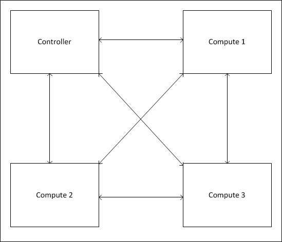
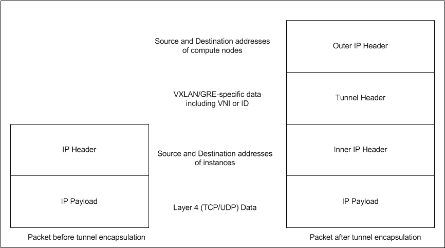

# Overlay Network

## Giới thiệu chung
- Overlay networking là công nghệ cho phép tạo ra các mạng ảo trên hệ thống mạng vật lý bên dưới (underlay network) mà không ảnh hưởng hoặc ảnh hưởng không đáng kể tới hạ tầng mạng bên dưới.
- Cụ thể hơn, với overlay network, ta có thể tạo ra các mạng ảo L2 trên nền hạ tầng mạng L3 network. Đứng ở góc độ cloud computing, các mạng L2 này là mạng riêng biệt của khách hàng, cách tiếp cận sử dụng mạng ảo overlay có nhiều ưu điểm hơn sử dụng L2-based, hay VLAN. Cụ thể hơn, nếu như với môi trường với số lượng endpoint nhỏ, VLAN là giải pháp hoàn hảo. Tuy nhiên nếu áp dụng ở góc độ Cloud Computing khi mà số lượng máy ảo khách hàng trên các máy chủ vật lý càng ngày càng tăng với số lượng lớn theo thời gian kéo theo yêu cầu cô lập các mạng ảo khách hàng thì nảy sinh vấn đề. Lúc này, để cho phép máy ảo khách hàng kết nối ra mạng ngoài, ta cần một lớp switch mềm kết nối các máy ảo này cấu hình các VLAN ID khác nhau tương ứng với các mạng ảo khách hàng, đồng thời các switch kết nối với máy chủ vật lý chứa các máy ảo khách hàng sẽ phải cấu hình các VLAN tương ứng với các mạng ảo. Điều đó rõ ràng không phù hợp với môi trường cloud khi mà số lượng endpoint tăng lên nhanh chóng với số lượng rất lớn, vì lúc này ta sẽ phải cấu hình các VLAN chính xác một cách thủ công trên các thiết bị mạng, gây ra vấn đề khó khăn trong quản lý mạng và không có tính mở rộng.
- Trong OpenStack, Neutron (khối cung cấp kết nối mạng như một dịch vụ) hỗ trợ một số công nghệ overlay network như GRE, VXLAN, NVGRE. Khi cấu hình overlay network cho mạng ảo, Neutron tạo nên các tunnnels point-to-point giữa mọi mạng và mọi compute nodes với nhau cũng như với các controller nodes sử dụng các physical interface. các tunnels này tạo nên __mesh network__, có nghĩa là mỗi host vật lý sẽ kết nối với mọi host khác. Ví dụ như đồ hình dưới có một controller kết nối với 3 compute node.

 

- Tư tưởng chung của các công nghệ như GRE hay VXLAN là khi một mạng overlay tạo nên thì sẽ có một ID duy nhất để định danh cho mạng đó đồng thời được sử dụng để đóng gói lưu lượng (traffic encapsulation). Mỗi gói tin giữa các instances trên các host vật lý khác nhau được dóng gói trên một host và gửi tới các host khác thông qua point-to-point GRE hoặc VXLAN tunnel. Khi gói tin tới host đích, các tunnel header sẽ bị loại bỏ (tại tunnel endpoint) và gói tin được chuyển tiếp tới bridge kết nối với instances. 
- Sơ đồ sau đây thể hiện gói tin trước và sau khi được đóng gói bởi host.

 

Theo hình mô tả ở trên, địa chỉ nguồn và đích trong outer IP header sẽ định danh cho endpoint của tunnel. Tunnel endpoints bao gồm compute nodes và bất kì host nào chạy các dịch vụ L3 và DHCP, có thể là controller node hoặc network node. Các địa chỉ nguồn và đích trong Inner IP header định danh cho các instances gửi và nhận payload.

## Một số công nghệ overlay network

### GRE
- GRE là giao thức tunneling point-to-point, trong đó inner frame được đóng gói GRE theo tài liệu RFC 2784 và RFC 2890. Trong đó trường __Key__ (chiếm 4 octects tương đương 32 bits) trong GRE header sử dụng để mang Tenant Network Identifier (TNI - định danh mạng khách hàng) và được sử dụng để cô lập các logical segment khác nhau.
- GRE đóng gói inner frame sử dụng IP protocol số 47 để truyền thông chứ không sử dụng TCP hay UDP

 

### VXLAN
- VXLAN hay Virtual Extensible LAN (VXLAN) là giao thức sử dụng UDP (cổng 4789) để truyền thông và một segment ID độ dài 24 bit còn gọi là VXLAN network identifier (VNID). 
- Với VXLAN, hash của header trong inner frame sử dụng để làm cổng nguồn của UDP. Kết quả là, một VXLAN flow  sẽ là duy nhất với các địa chỉ IP và UDP ports kết nối với nhau trong IP header khi duyệt qua mạng vật lý bên dưới. 

 

### Tunnel End Point

- Chức năng của Tunnel Endpoint là đóng gói VM trafic trong một IP header để gửi qua mạng IP bên dưới. 
- Các máy ảo không thể nhận biết được các Tunnel Endpoint mà chỉ gửi lưu lượng untagged hoặc VLAN-tagged mà cần phải phân loại và kết nối với Tunnel Endpoint.
- Triển khai thường thấy của Tunnel Endpoint là bên trong một switch mềm như Open vSwitch cùng host với máy ảo. Tuy nhiên cũng có những trường hợp triển khai Tunnel Endpoint trong switch vật lý cho phép hiệu suất và thông lượng cao.

 

 Trên đây là topo đơn giản với các tunnel endpoint là __tep0__ trên các bridge __br1___ ở hai host vật lý.  Trong khi đó mỗi bridge __br0__ mà các máy ảo gắn vào là các bridge độc lập, tương đương với khái niệm __integration bridge__ trên OpenStack Compute node (br-int), làm nhiệm vụ trao đổi internal VLAN ID sang internal tunnel ID khi gói tin từ máy ảo gửi tới hoặc gỡ bỏ internal VLAN ID cho gói tin để gửi về máy ảo khi có lưu lượng đi tới máy ảo đó. 
 
## Linux Network Namespace
- Thông thường, một bản cài đặt Linux sẽ chia sẻ chung tập hợp các network interfaces và các bản ghi trên bảng định tuyến. Ta có thể chỉnh sửa bảng định tuyến sử dụng các chính sách định tuyến, tuy nhiên về căn bản thì điều đó không thay đổi thực tế là các network interfaces và các bảng định tuyến vẫn chia sẻ chung khi xét trên toàn bộ hệ điều hành. 
Linux network namespaces được đưa ra để giải quyết vấn đề đó. Với linux namespaces, ta có thể có các máy ảo tách biệt nhau về network interfaces cũng như bảng định tuyến khi mà các máy ảo này vận hành trên các namespaces khác nhau. Mỗi network namespaces có bản định tuyến riêng, các thiết lập iptables riêng cung cấp cơ chế NAT và lọc đối với các máy ảo thuộc namespace đó. Linux network namespaces cũng cung cấp thêm khả năng để chạy các tiến trình riêng biệt trong nội bộ mỗi namespace. 

- Trong networking, khái niệm tương tự network namespaces của Linux là VRF - Virtual Routing and Forwarding, là một tính năng cấu hình được trên các router như của Cisco hoặc Alcatel-Lucent, Juniper,...VRF là một công nghệ IP cho phép tồn tại cùng một lúc nhiều routing instance trong cùng 1 router ở cùng một thời điểm (multiple instances of a routing table). Do các routing instances này là độc lập nên nó cho phép sự chồng lấn về địa chỉ IP subnet trên các intefaces của router mà không gặp tình trạng xung đột. Có thể hiểu VRF giống như VMWare cho router vậy, còn các routing instances tương tự như các VMware guest instances, hoặc cũng có thể hiểu nó tương tự như VLANs tuy nhiên VRF hoạt động ở layer 3.
 
- Trong OpenStack, Linux network namespace được sử dụng tạo các router namespace và các dhcp namespace để cấp phát ip cho các mạng ảo của các khách hàng và định tuyến ra mạng ngoài cho các máy ảo của mỗi khách hàng.
 
## Tham khảo
 - [http://blog.scottlowe.org/2013/05/07/using-gre-tunnels-with-open-vswitch/](http://blog.scottlowe.org/2013/05/07/using-gre-tunnels-with-open-vswitch/)
 - [https://docs.openstack.org/mitaka/networking-guide/deploy-ovs-selfservice.html](https://docs.openstack.org/mitaka/networking-guide/deploy-ovs-selfservice.html)
 - [https://thenetworkway.wordpress.com/2014/07/01/the-need-for-network-overlays-part-i/](https://thenetworkway.wordpress.com/2014/07/01/the-need-for-network-overlays-part-i/)
 - [https://thenetworkway.wordpress.com/2014/11/30/the-need-for-network-overlays-part-ii/](https://thenetworkway.wordpress.com/2014/11/30/the-need-for-network-overlays-part-ii/)
 - Ebook: Learning OpenStack Networking (Neutron) Second Edition
 - [https://www.youtube.com/watch?v=_WgUwUf1d34](https://www.youtube.com/watch?v=_WgUwUf1d34)
 - [http://www.opencloudblog.com/?p=42](http://www.opencloudblog.com/?p=42)
 